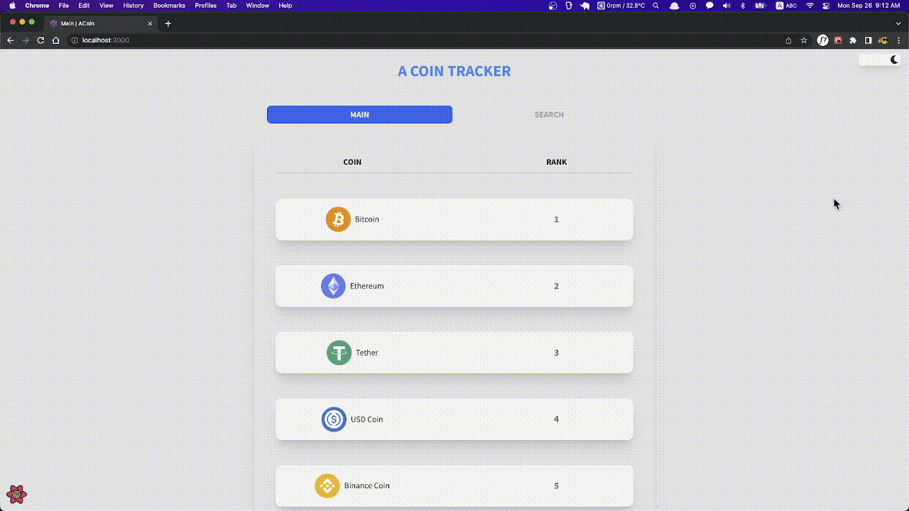

    

        
      <a display="block" href="https://acoin.netlify.app" >
      https://acoin.netlify.app
    </a>
    

     

  

  

  

## Content

- 🛠 [Built with](#built-with)
- 🚀 [Project](#project)
- 📖 [Pages](#pages)
- ✓ [Features](#features)

---

## Built with

### Front-end

- `React`
- `Typescript`
- `recoil`
- `react-query`
- `apex chart`
- `Styled-components`
- `Framer-motion`
- `React-hook-form`

---

## Features

- 코드의 복잡성을 줄이기 위해 styled-components를 활용하여 반복되는 폰트사이즈, 컬러, 마진, 페딩 등 정리하였습니다.
- 다크모드 구현에 따른 props 전달의 복잡성을 해결하기 위해 recoil 라이브러리를 활용하였습니다.
- 캐시데이터를 활용한 성능향상과 효율성을 위해 react-query 라이브러리를 활용하였습니다.
- 데이터 시각화를 위하여 apex chart 라이브러리를 활용하였습니다.

---

## Project

- 암호화폐의 순위와 각각의 정보를 간략히 보여주는 애플리케이션입니다.
   

> 네비게이션

- 메인페이지와 검색페이지로 나눠보았습니다.
- 각각의 암호화폐와 순위를 볼 수 있습니다.
- 클릭시 해당페이지로 전환됩니다.
- 상단 오른쪽에 다크모드 버튼을 클릭하여 다크모드로 변경할 수 있습니다.

 
  

> 상세페이지

- 코인에 대한 정보 (가격, 시간에 따른 가격변동, 시가총액)를 확인할 수 있습니다.
- apx chart라이브러리를 활용하여 날짜순에 따른 가격변동의 차트를 구현했습니다.
- 차트값은 Open, Hight, low, close, volume입니다.

 
  

> 검색페이지

- 암호화페의 이름으로 관련 검색하면 관련 암호화페를 확인할 수 있습니다.

 
  

## Pages

> 홈

- 50개의 암호화페순위
- 검색

> 상세페이지

- 상세페이지

  
